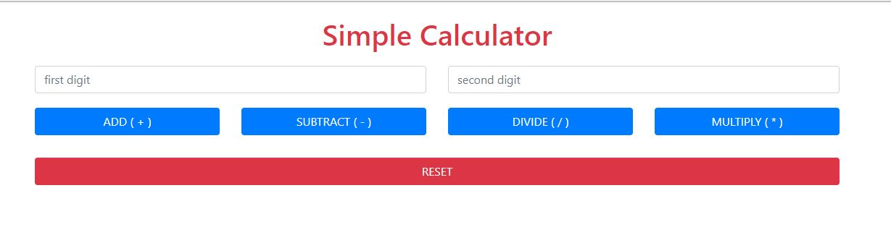
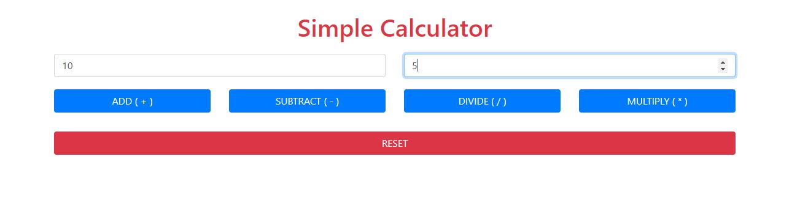
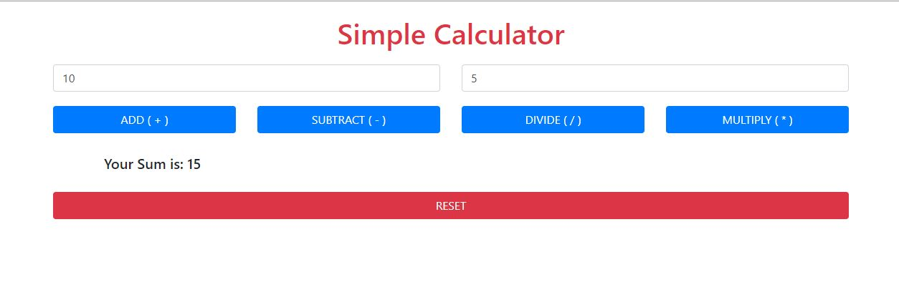

# Simple-calculator
A simple calculator application in PHP {using Php function, Php form handling} for calculation,i.e Addition,Subtraction,Division and Multiplication.
# Design

# Enter digits

# Results

